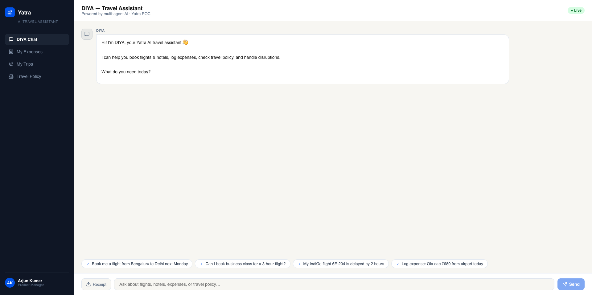
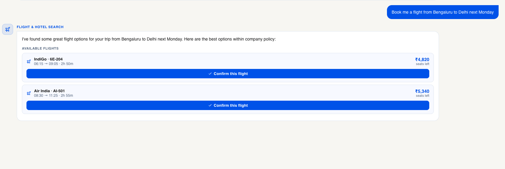
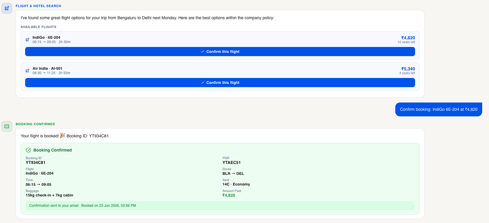
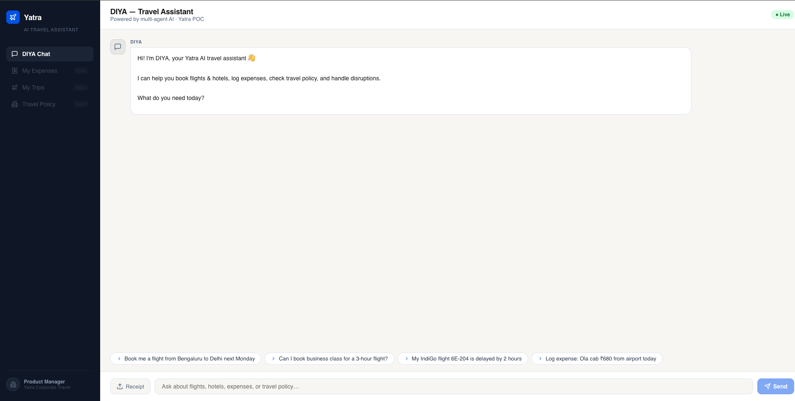
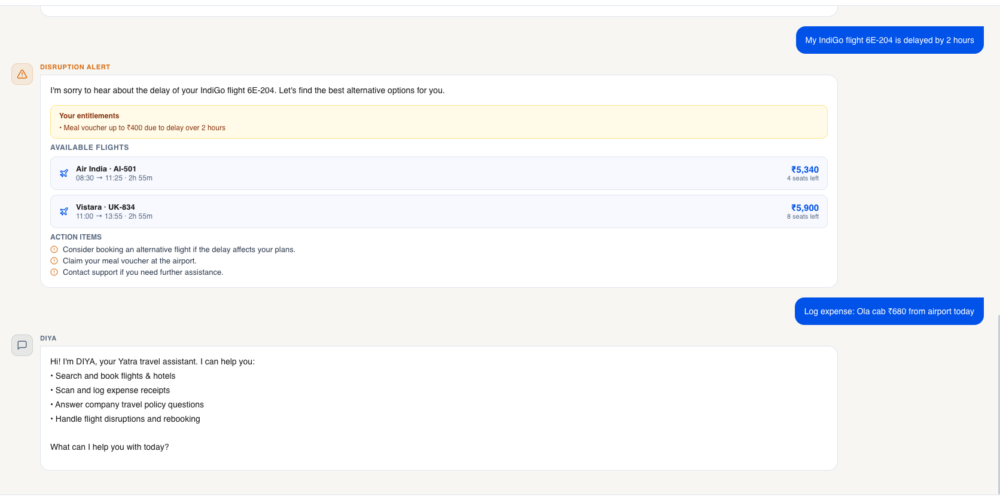
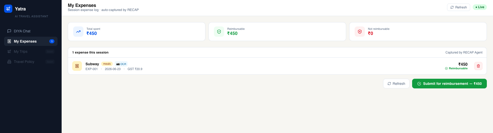
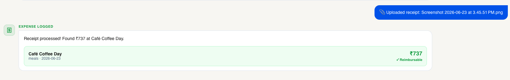
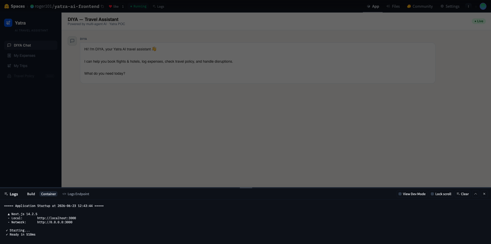
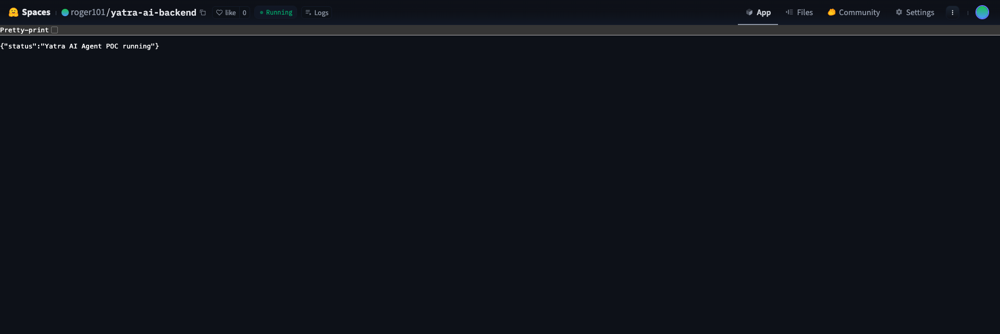

# ✈️ Yatra Multi Agent AI Travel Assistant — POC

> A multi-agent AI system inspired by Yatra's **DIYA** (travel booking) and **RECAP** (expense management) products, built on OpenAI API and deployed on Hugging Face Spaces.

🔗 **Live Demo:** [roger101-yatra-ai-frontend.hf.space](https://roger101-yatra-ai-frontend.hf.space)

**Yatra blog** (https://cloud.google.com/customers/yatra)

---

## 🤖 What it does

DIYA is a corporate travel assistant that handles the full trip lifecycle — from booking to expense reporting — using 5 specialized AI agents that collaborate behind a single chat interface.

| Agent | Model | Responsibility |
|---|---|---|
| **Orchestrator** | GPT-4o-mini | Classifies intent, routes to correct agent |
| **Booking (DIYA)** | GPT-4o | Extracts travel details, searches flights/hotels, applies policy |
| **Policy** | GPT-4o-mini | Answers company travel policy questions |
| **Expense (RECAP)** | GPT-4o Vision | Parses receipts via text or image OCR |
| **Disruption** | GPT-4o | Handles delays, cancellations, suggests alternatives |

---

## 🏗️ Architecture

```
User (Next.js UI)
       │
       ▼
  FastAPI Backend
       │
  Orchestrator Agent (GPT-4o-mini) — classifies intent
       │
   ┌───┼──────────┬──────────┐
   ▼   ▼          ▼          ▼
Booking  Policy  Expense  Disruption
Agent    Agent   Agent    Agent
(GPT-4o) (mini) (4o-vision) (GPT-4o)
```

---

## ✅ Features

- 🔍 **Natural language flight & hotel search** with company policy enforcement
- ✈️ **Confirm booking** — generates Booking ID, PNR, seat, baggage details
- 🏛️ **Policy Q&A** — exact policy clause citations with allowed/not-allowed status
- ⚠️ **Flight disruption handling** — entitlements, alternative flights, action items
- 🧾 **Expense logging via text** — merchant, amount, category, reimbursability
- 📷 **Receipt OCR via image** — GPT-4o Vision extracts GST, line items, totals
- 📊 **My Expenses tab** — session log with reimbursement totals and submit button
- 🗂️ **My Trips tab** — boarding-pass style confirmed booking cards

---

## 📸 Screenshots

### DIYA Chat Interface


### Flight Booking Flow


### Booking Confirmed


### Policy Check


### Disruption Alert


### Expense Logging (Text)


### Receipt OCR (Image)


### My Expenses Tab


### My Trips Tab


### Live on Hugging Face Spaces





---

## 🚀 Quick Start

### Backend
```bash
cd backend
cp .env.example .env
# Add your OpenAI API key to .env

pip install -r requirements.txt
uvicorn main:app --reload --port 8000
```

### Frontend
```bash
cd frontend
cp .env.local.example .env.local
# Set NEXT_PUBLIC_API_URL=http://localhost:8000

npm install
npm run dev
```

Open [http://localhost:3000](http://localhost:3000)

---

## 🧪 Test Prompts

| Agent | Prompt |
|---|---|
| Booking | "Book me a flight from Bengaluru to Delhi next Monday" |
| Policy | "Can I book business class for a 3-hour flight?" |
| Disruption | "My IndiGo flight 6E-204 is delayed by 2 hours" |
| Expense (text) | "Log expense: Ola cab Rs.680 from airport today" |
| Expense (image) | Upload any receipt via the Receipt button |

---

## 💰 Estimated Cost

| Volume | Monthly API Cost |
|---|---|
| Dev/demo (100 req/day) | ~$3–8 |
| With prompt caching | ~$1.50–4 |

Uses GPT-4o-mini for routing/policy (cheap) and GPT-4o for booking/expense/disruption (powerful).

---

## 🛠️ Tech Stack

| Layer | Tech |
|---|---|
| Frontend | Next.js 14, React, Lucide icons |
| Backend | FastAPI, Python 3.11 |
| AI | OpenAI GPT-4o + GPT-4o-mini |
| Deployment | Hugging Face Spaces (Docker) |
| Agent orchestration | Custom multi-agent routing |

---

## 📁 Project Structure

```
Yatra_AI_Travel_Assistant/
├── backend/
│   ├── main.py                  # FastAPI app
│   ├── agents/
│   │   ├── orchestrator.py      # Intent classification
│   │   ├── booking_agent.py     # Flight & hotel search
│   │   ├── policy_agent.py      # Policy Q&A
│   │   ├── expense_agent.py     # Receipt parsing
│   │   └── disruption_agent.py  # Delay handling
│   ├── routes/
│   │   ├── chat.py              # Main chat endpoint
│   │   ├── booking.py           # Booking endpoints
│   │   ├── expense.py           # Expense endpoints
│   │   └── disruption.py        # Disruption endpoint
│   └── utils/
│       └── mock_data.py         # Mock flights & hotels
└── frontend/
    └── src/
        ├── pages/index.js       # Main chat UI
        └── lib/api.js           # API client
```

---

## 🙏 Inspiration

Built as a POC inspired by [Yatra's Google Cloud case study](https://cloud.google.com/customers/yatra) where they built DIYA (AI travel assistant) and RECAP (automated expense management) using Gemini and Google Cloud AI.

---

* Powered by OpenAI · Deployed on Hugging Face*
